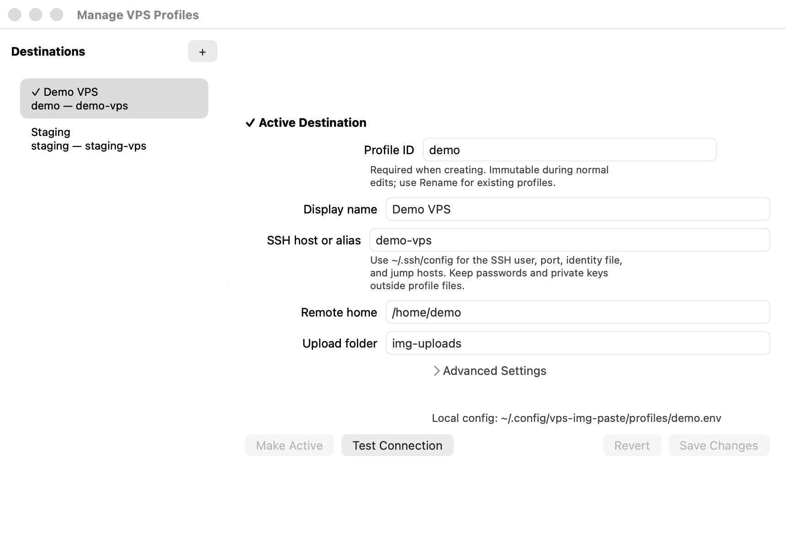

<p align="center">
  
</p>
<h1 align="center">VPS Image Paste</h1>
<p align="center">Send a Mac clipboard image or screenshot to any SSH host, then paste the remote path into your terminal.</p>
<p align="center">
  <a href="https://github.com/SerenityTn/vps-img-paste/actions/workflows/ci.yml"></a>
  <a href="https://github.com/SerenityTn/vps-img-paste/releases/latest"></a>
  <a href="#requirements"></a>
  <a href="LICENSE"></a>
</p>

VPS Image Paste is a native macOS menu-bar app and Bash CLI. It turns an image on your Mac into a remote file path that terminal tools can consume. No clipboard watcher, cloud account, daemon on the server, or proprietary protocol is required. Transfers use your existing OpenSSH setup.



## Why it exists

Text paste crosses an SSH session; image paste does not. Terminal agents and CLI tools can usually attach a file when you paste its path, so VPS Image Paste bridges the gap:

1. Copy an image, or take a screenshot.
2. Click the menu-bar icon.
3. The app uploads a PNG over SCP.
4. Paste the resulting remote path into the SSH session.

If the clipboard has no image, the app can capture a region or the full display. After the configured grace period, it restores the clipboard content that existed before the upload.

## Features

- Native AppKit menu-bar app for macOS 13 and newer.
- Clipboard image upload plus explicit region and full-screen capture.
- Multiple named VPS profiles with persistent active-destination selection.
- Native profile manager with add, edit, duplicate, rename, activate, connection test, and delete actions.
- Uploaded-image listing, download/open, and confirmed remote cleanup.
- Secure literal profile parser; profile files are never sourced or evaluated.
- Existing `~/.ssh/config`, keychain, and SSH-agent support.
- Apple Silicon and Intel source builds.
- Standalone CLI with stable machine-readable profile output.

## Quick start

### Install with Homebrew

```sh
brew install SerenityTn/tap/vps-img-paste
brew services start vps-img-paste
```

Secondary-click the new menu-bar icon, open **Destination**, choose **Manage Profiles**, and add a destination. Configure the remote login first if needed:

```sshconfig
Host work-vps
  HostName 203.0.113.10
  User me
  IdentityFile ~/.ssh/work_ed25519
```

Then use these profile values:

```text
Display name: Work VPS
SSH host or alias: work-vps
Remote home: /home/me
Upload folder: img-uploads
```

Create the remote folder once:

```sh
ssh work-vps 'mkdir -p ~/img-uploads'
```

Left-click the menu-bar icon to upload. Secondary-click it to switch destinations, capture explicitly, load uploaded images, manage profiles, or clean the active destination.

### Install from source

```sh
git clone https://github.com/SerenityTn/vps-img-paste.git
cd vps-img-paste
./install.sh
```

The source installer builds `~/Applications/VpsImgPaste.app`, links the CLI at `~/bin/vps-img-paste`, and starts a user LaunchAgent. Existing legacy or named profile configuration is preserved.

## Menu behavior

| Action | Result |
| --- | --- |
| Left-click | Upload the clipboard image; if none exists, use the configured screenshot fallback. |
| Secondary-click or Option-click | Open the destination and upload menu. |
| Destination | Persistently change the active profile or open the profile manager. |
| Capture Region | Request Screen Recording access, select a region, and upload it. |
| Capture Full Screen | Capture the main display and upload it. |
| Uploaded Images | Load/refresh remote PNGs, then download one and open it in Preview. |
| Clean All Uploads | Confirm and delete PNG uploads from the selected profile's configured remote directory. |

The status icon changes while work is in progress and briefly shows success or failure. The app acts only when you invoke it; it does not monitor the clipboard or register a global hotkey.

## CLI examples

```sh
vps-img-paste                       # upload to the active profile
vps-img-paste --profile work upload # one-command profile override
vps-img-paste region                # capture a region and upload
vps-img-paste list                  # SIZE<TAB>NAME, newest first
vps-img-paste fetch NAME.png        # download and print the local path

vps-img-paste profiles
vps-img-paste profile current
vps-img-paste profile use work
vps-img-paste profile inspect work
vps-img-paste profile test work
```

See [the complete CLI reference](docs/CLI.md) for profile creation, updates, rename, deletion, output contracts, and exit behavior.

## Configuration

Named profiles live under:

```text
~/.config/vps-img-paste/profiles/<id>.env
~/.config/vps-img-paste/active-profile
```

The app stores a label, SSH host or alias, absolute remote home, relative upload folder, screenshot mode, and clipboard restore delay. Passwords, private keys, ports, and jump-host configuration are not app-managed profile fields.

Profile files are parsed as literal data. Dynamic supported values such as `${USER}`, command substitution, backticks, `source`, and functions are not executed. Existing manual files with literal supported fields remain usable but read-only in the GUI.

Read [Profile configuration](docs/CONFIGURATION.md) for the field reference, SSH aliases, parser contract, permissions, and legacy migration behavior.

## Permissions and signing

Region and full-screen capture require macOS Screen Recording permission. The app asks only when an explicit capture needs it:

**System Settings → Privacy & Security → Screen Recording → VPS Image Paste**

Clipboard-only uploads do not require Screen Recording access.

Current source and Homebrew builds are compiled locally and ad-hoc signed. A stable designated requirement keeps the app's Screen Recording identity consistent across rebuilds, but the build is not Apple-notarized. Review [SECURITY.md](SECURITY.md) for the trust model and private vulnerability-reporting channel.

## Requirements

- macOS 13 or newer, Apple Silicon or Intel.
- Xcode Command Line Tools for source builds.
- [`pngpaste`](https://github.com/jcsalterego/pngpaste) to read clipboard images.
- SSH key access to the destination host.

The Homebrew formula installs `pngpaste`. For a source build:

```sh
xcode-select --install
brew install pngpaste
```

## Development

```sh
brew install shellcheck
make check       # lint, isolated integration tests, Swift tests, app build/signature
make build       # build the app in ~/Applications
make icon        # regenerate AppIcon.icns from the SVG source
make screenshot  # regenerate the README screenshot with fixture data
```

Tests use temporary homes and mocked network, clipboard, screenshot, installer, and LaunchAgent commands. They do not contact a real VPS.

The CLI is the authority for parsing, validation, profile persistence, and remote operations. The AppKit layer invokes it with argument arrays and does not write shell-backed configuration directly. Read [CONTRIBUTING.md](CONTRIBUTING.md) before changing those boundaries.

## Troubleshooting

### The app cannot connect

Run the same alias through OpenSSH, then use the read-only profile test:

```sh
ssh work-vps true
vps-img-paste profile test work
```

Keep ports, users, key paths, and jump hosts in `~/.ssh/config`.

### Upload succeeds but the expected folder is empty

Check that **Remote home** is the SSH account's real absolute home and that **Upload folder** is relative to it. All operations use exactly `VPS_REMOTE_HOME/VPS_REMOTE_DIR`.

### Screenshot capture is unavailable

Confirm Screen Recording permission for **VPS Image Paste**, then quit and reopen the app. Clipboard-image uploads can still work without that permission.

### Two menu-bar icons appear

An older Homebrew service or source LaunchAgent may still be running. Re-run the installation method you want to keep. The source installer removes known obsolete Homebrew launch paths before loading its current app.

## Upgrade and uninstall

Homebrew:

```sh
brew update
brew upgrade vps-img-paste
brew services restart vps-img-paste
```

Source checkout:

```sh
git pull --ff-only
./install.sh
```

Remove a source installation:

```sh
./uninstall.sh
```

Uninstalling preserves profile configuration. Delete it manually only if you no longer need it.

## Community

- [Contributing guide](CONTRIBUTING.md)
- [Security policy](SECURITY.md)
- [Code of conduct](CODE_OF_CONDUCT.md)
- [Changelog](CHANGELOG.md)
- [MIT License](LICENSE)